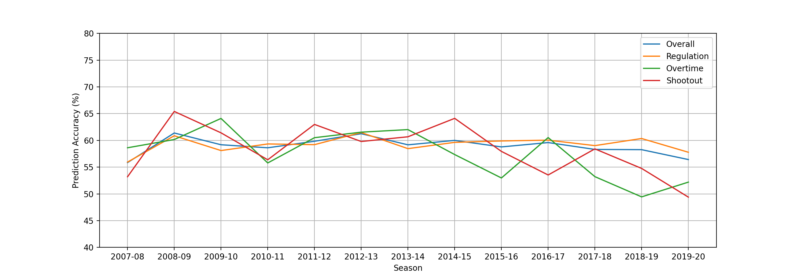
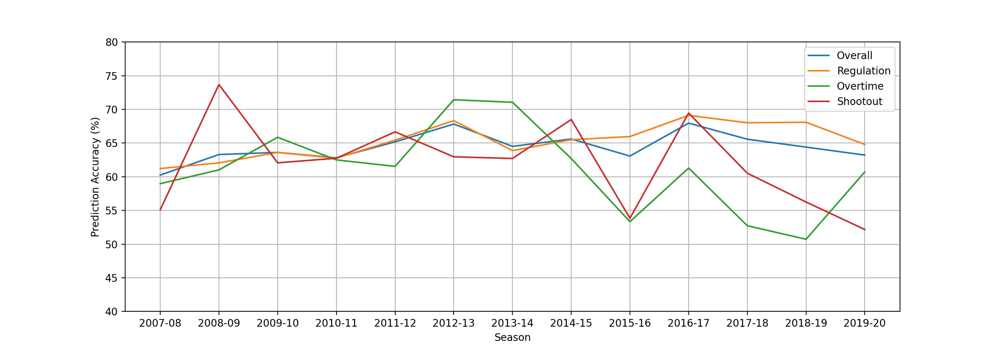

# Overtime versus Shootout

 I have always disliked the hockey shootout; the game should be played until there is a winner not stopped for a skills competition. Though some enjoy the spectacle, the fact that the NHL does not allow playoff games to be decided by shootouts indicates that many, like myself, are opposed to the shootout. Here I take an analytical approach to the debate on whether shootouts are a "good" way to decide a game.

 I first ask myself: how often does the better team win in overtime versus a shootout?

 Determining the "better" team is no simple matter. Predicting the outcome of a game remains a serious challenge in hockey analytics. The results of hockey games are correctly forecasted only about 60% of the time (see for example, this [article from Corsica](https://www.corsicahockey.com/corsica-predictions-explained)). While it cannot boast a high degree of certainty, the predicted winner does provide an indication of the stronger team. Win probabilities can be calculated from betting odds for NHL games, which are widely availbale. I used odds and scores scraped from [Sports Book Reviews](https://www.sportsbookreviewsonline.com/scoresoddsarchives/nhl/nhloddsarchives.htm) while the type of ending for the game was collected from [Hockey Reference](https://www.hockey-reference.com/leagues/NHL_2020_games.html). By counting the number of games won by the team with better odds, I was able to get a sense for how often the stronger team wins when the game ends in regular time, in overtime, and in a shootout. The graph below shows the percent of time the odds correctly predicted the winner for each season.

  

 Perhaps somewhat suprisingly, there is no trend. In fact, in exactly half of the seasons, the team with better odds won in shootouts **more often** than in overtime. On average games ending in overtime were won by the predicted team 57.6% of the time, while in shootouts the average was actaully slightly higher at 58.3%. It is interesting to note that the overall prediction accuracy, and accuracy for games ending in regular time, hovers around 60% as expected. Going one step further, I even restricted the analysis to games where the odds gave one team a 60% chance or higher of winning (i.e. games where there was a clear favourite).

  

 Even still, the better team, at least as far as betting odds can determine, is just as likely to win in overtime as in shootouts.

